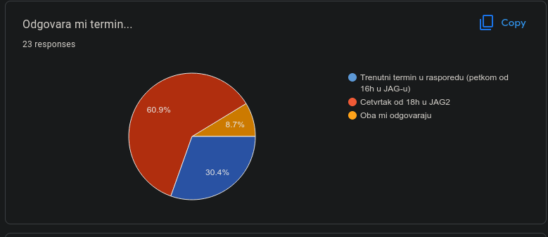

# РС2 - Информације које се односе на вежбе

[РС 2](../../README.md) [Вежбе](../README.md)

#### Отказивање вежби у четвртак 22. новембра

**Датум објаве: 21.11.2024.**

Вежбе неће бити одржане у петак 22. новембра.

<!--- 

#### Анкета за пријаву

**Датум објаве: 22.12.2023.**
Окачена је анкета за пријаву семинарског рада.  [Линк](../../seminarski-radovi/info/README.md)

---

#### Отказивање вежби у четвртак 29. децембра

**Датум објаве: 27.12.2022.**

Вежбе неће бити одржане у четвртак 29. децембра.

---

#### Отказивање вежби у четвртак 10. новембра

**Датум објаве: 08.11.2022.**

Вежбе неће бити одржане у четвртак 10. новембра.

---

#### Анкета о промени термина вежби

**Датум објаве: 22.10.2022.**

На захтев студената, постављена је анкета о промени термина вежби. Резултати ће бити објављени пре среде 25. октобра како би студенти имали довољно времена за организацију. Форма се може наћи на [линку](https://forms.gle/bRcyiEBmBSY1oHQSA).

**На основу резултата анкете, нови термин вежби ће бити четвртком од 18 часова у Јагићевој (учионица 3). Резултати анкете:**

---

#### Информације о првом часу вежби у 2022/23. години

**Датум објаве: 8.10.2022.**

Први час вежби за мастер студенте биће у понедељак, 17. октобра 2021. године. Часови ће се одржавати уживо према званичном распореду часова.
 -->
---

[РС 2](../../README.md) [Вежбе](../README.md)